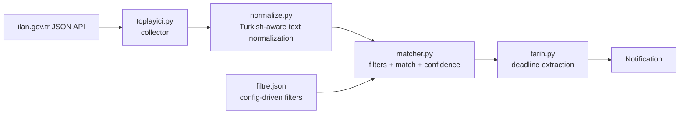
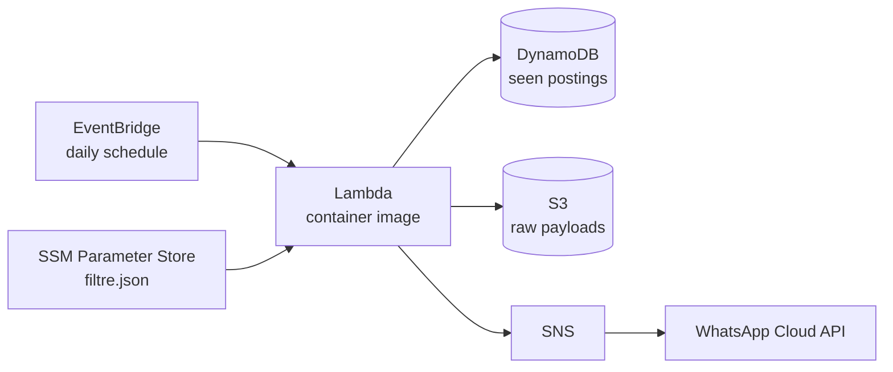

# rg-ilan-botu

**Job-posting alert system for Turkey's Official Gazette (Resmî Gazete).**
Monitors official announcements for *Physiotherapy & Rehabilitation research assistant* positions and sends a WhatsApp notification the day one is published — instead of someone manually checking a government PDF every morning.

> **Data source note:** the project originally parsed Resmî Gazete HTML/PDFs directly. RG blocks all cloud IP ranges (AWS, GitHub, Azure), so the live pipeline was migrated to the **ilan.gov.tr JSON API**, which publishes the same announcements. The RG-specific modules (`fetcher.py`, `pdftext.py`, `segment.py`, `backfill.py`) are kept as a tested reference implementation but are no longer on the live path.

## Architecture

**Current pipeline:**



**Target AWS deployment (in progress, `infra/`):**



## Key design decision: segment-based matching

A single Gazette document can contain **multiple independent job postings**. `tests/fixtures/kmu_20260416.txt` is a real example: one file contains both a research assistant posting *and* a faculty posting that mentions physiotherapy. Searching the document as a whole would produce a false positive; splitting on posting codes (e.g. `3795/1-1`) and matching per segment correctly yields zero matches for that file.

Both behaviors are proven in tests:
`test_segmentasyonsuz_yanlis_alarm_verirdi` (whole-document search would false-alarm) vs. `test_segmentli_dogru_sonuc_sifir_eslesme` (segmented search is correct).

Other things Turkish text makes non-trivial (all covered by tests):

- **İ/ı casing trap** — Python's default `.lower()` breaks Turkish; normalization handles it explicitly
- Line-break healing and abbreviation variants (`Arş. Gör.` / `Arş.Gör.`)
- **Exclusion logic** — "Fiziksel Tıp ve Rehabilitasyon" (a medical specialty) must *not* match "Fizyoterapi ve Rehabilitasyon"
- Application-deadline extraction from the posting text, with a 15-day fallback

## Config-driven filters (no redeploy needed)

`filtre.json`:

```json
{
  "pozisyon": ["Araştırma Görevlisi", "Arş. Gör.", "Arş.Gör.", "Öğretim Görevlisi"],
  "alan": ["Fizyoterapi", "Fizik Tedavi ve Rehabilitasyon"],
  "disla": ["Fiziksel Tıp ve Rehabilitasyon"]
}
```

Changing what the bot looks for is a JSON edit, not a code change. In production the same JSON is read from SSM Parameter Store. Loading is covered by `test_filtre_json_yukleme`.

## Setup

```bash
python3 -m venv .venv && source .venv/bin/activate   # Windows: .venv\Scripts\activate
pip install -r requirements.txt
pip install -e .
python -m pytest        # expect: 25 passed
```

`pip install -e .` registers the package, so the `rgbot-backfill` CLI works from any directory.

## Backfill: scanning a year of history

```bash
rgbot-backfill --baslangic 2025-08-01 --bitis 2026-08-01 --cikti tarama/
```

- Waits 1s between requests; ~250 business days take a few hours
- Resumable — re-running the same command skips already-downloaded documents
- Output: `tarama/rapor.csv` (one row per document) and `tarama/eslesmeler.jsonl` (matched segments with details)

The backfill answers three questions: how often the target posting actually appears, the filter's false-positive rate, and which real positives should be promoted into `tests/fixtures/` to grow the regression golden set.

## Project layout

```
src/rgbot/
  toplayici.py   live collector (ilan.gov.tr API)
  ilanapi.py     API client
  normalize.py   Turkish-aware normalization (foundation for everything)
  matcher.py     filters + matching + confidence (KESIN / SUPHELI)
  tarih.py       deadline extraction
  segment.py     posting-code segmentation      (RG legacy, tested)
  pdftext.py     pdfplumber text/table layer    (RG legacy, tested)
  fetcher.py     index discovery + download     (RG legacy, cp1254!)
  backfill.py    historical scan CLI
infra/           Terraform (AWS deployment — in progress)
tests/           25 tests + real-document fixtures
```

## Roadmap

1. Filter tuning based on backfill results
2. Terraform: EventBridge + Lambda (container) + S3 + DynamoDB + SSM + SNS
3. WhatsApp Cloud API integration (utility template approval)
4. Dead-man's-switch alarms (PageFound / PdfCount metrics — a scraper that silently stops is worse than one that crashes)
5. Reminder Lambda (3 days before the application deadline)
